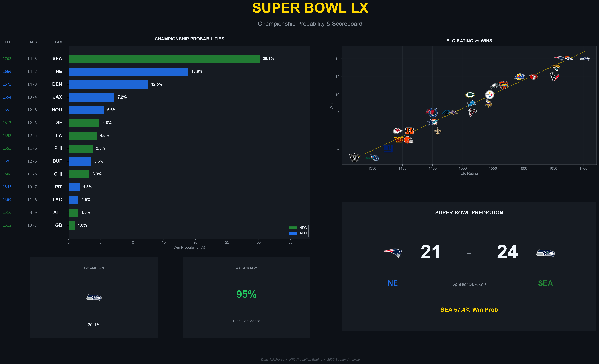

# SuperBowl Predictor

A Python-based NFL prediction engine that forecasts the 2025 Super Bowl using a weighted ensemble of 9 statistical models (Elo, EPA, SRS). Runs 10,000 Monte Carlo playoff simulations to calculate true win probabilities and betting odds, accounting for QB matchups and team momentum.

## Features

- **Multi-Model Ensemble**: Combines Elo, Pythagorean, SRS, Power Ratings, Recent Form, QB Elo, and EPA models.
- **Monte Carlo Simulation**: Simulates the remainder of the season and playoffs (10,000 simulations) to project Super Bowl winners.
- **Visual Dashboard**: Generates comprehensive graphical dashboards (Win Probability, Elo Scatter, Scoreboard).
- **Advanced Metrics**: Includes dynamic Home Field Advantage (HFA) and Upset Detection logic.

## Ensemble Models

The system aggregates predictions from the following weighted models:
1.  **Elo Rating**: Standard rating system with home field advantage calibration.
2.  **EPA (Expected Points Added)**: Measures offensive and defensive efficiency based on play-by-play data.
3.  **Simple Rating System (SRS)**: Point differential adjusted for strength of schedule.
4.  **Power Ratings**: Iterative offensive/defensive strength calculations.
5.  **Pythagorean Expectation**: Win probability derived from points for/against.
6.  **Recent Form**: Weighted analysis of the last 5 games performance.
7.  **QB Elo**: Quarterback-specific rating adjustments.
8.  **Enhanced Statistical Model**: Logistic regression on advanced feature set including situational splits.
9.  **Championship Predictor**: Random Forest classification of playoff contenders.

## Installation

Ensure you have Python 3.8+ installed.

1.  **Clone the repository** (if applicable) or navigate to the project directory.
2.  **Install dependencies**:
    ```bash
    pip install -r requirements.txt
    ```

## Usage

### Generating Predictions & Visualizations

To run the main analysis and generate the Super Bowl prediction dashboard:

```bash
python generate_results.py
```

This will:
1.  Fetch the latest data from NFLVerse.
2.  Train all models on the current season's completed games.
3.  Simulate the playoffs and Super Bowl 10,000 times.
4.  Generate a dashboard image in `results/superbowl_prediction.png`.

## Results



### Running the Prediction Engine

To run the prediction logic and see the probability output in the console:

```bash
python predict.py
```

This executes the full prediction pipeline and outputs the ranked probabilities for all playoff contenders.

## Project Structure

- `src/models/`: Contains individual statistical models (Elo, EPA, HFA, etc.).
- `src/simulation/`: Logic for season and playoff simulations.
- `src/data/`: Data fetching and storage handlers.
- `src/utils/`: Helper utilities (e.g., Upset Detection).
- `generate_results.py`: Main script for generating the visualization dashboard.
- `predict.py`: Entry point for running predictions.

## Data Source

This project uses `nfl_data_py` to source data from the [nflverse](https://nflverse.com/) ecosystem.
